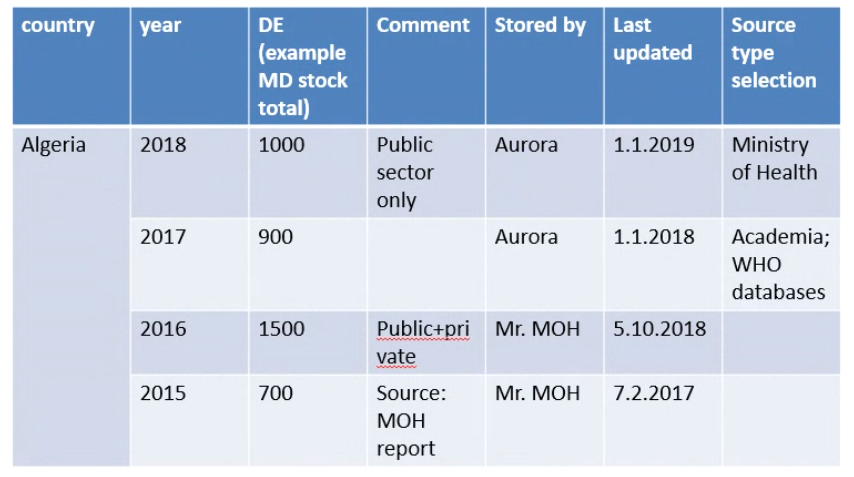
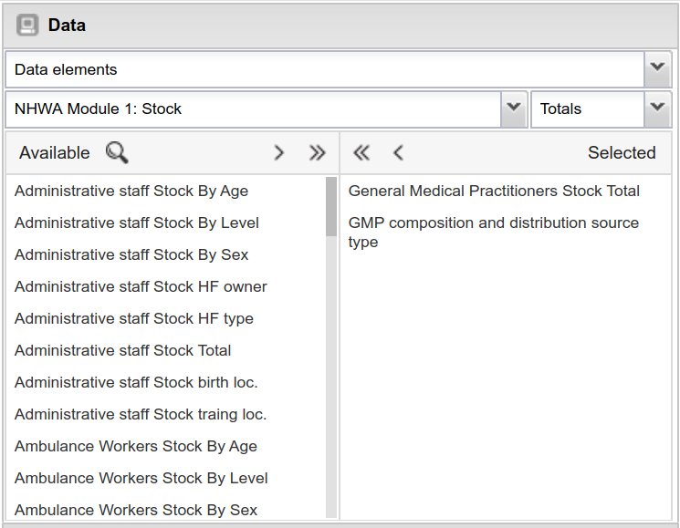
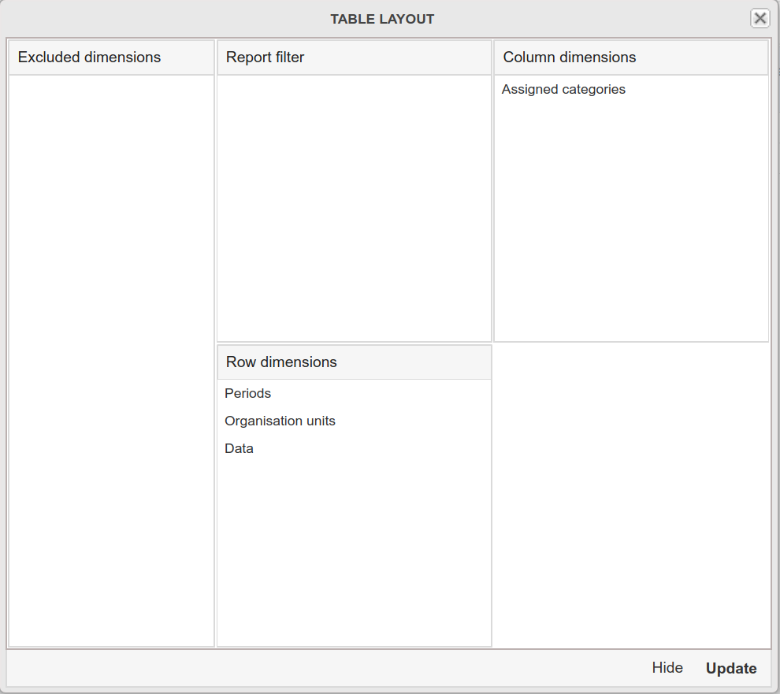
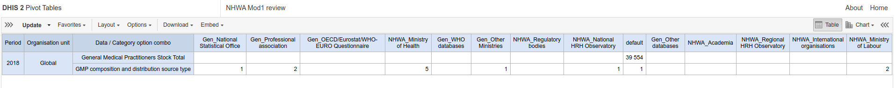
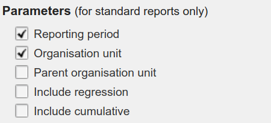
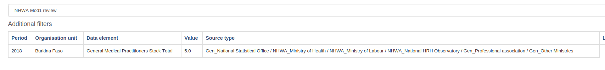

# Extended pivot table
This HTML-based report collects a pivot table from the existing list of pivot tables in a DHIS2 and add sugar-syntax specific to HWF requirements. The functionalities added are the following:
- [x] Show Source Type in aggregate format by the data element instead of all the categories.
- [ ] Enable the monitoring of authorship and history of updates for each data value (by means of *api/dataValueAudit*) -> Hover attribute of the cell for long history of updates.
- [ ] Visualize the comments added to this data value. Two different sources: Native comment functionality of DHIS2 Data Entry or custom Data Elements added to include comments.

Including mockup of the interface:

The approach consists in generating an HTML report that allows the user to choose a desired pivot table, a reporting organization unit and a reporting period. The report interprets the pivot table to show the correct layout and integrates the comments and audit trail to the interface. Several steps involving the DHIS2 user and the IT developer are required:
- Initially the pivot table must include all the required data elements as well as its source type data elements. For instance this example is going to use in the following images the data element **General Medical Practitioners** with its corresponding source type in the data element **GMP source type**.

- The pivot table layout should include the assigned categories and the correct dimensions.

  The final pivot table (with only one data element and one source type) should look like this:

 - Before **adding the new pivot table to favorites**, include the following parameters in the table options:

 

 - Finally, by creating a new report and choosing the desired pivot table. This should be the result:

 

